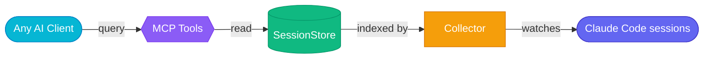

# Your AI agents don't sleep. Now neither does their memory.
{: .fs-9 .fw-700 .text-center .mb-4 }

Step away from your desk and productivity drops to zero. AgentiBridge makes your Claude Code sessions persistent, searchable, and remotely controllable — from any MCP client.
{: .fs-5 .text-center .text-grey-dk-100 .mb-6 }

{: .d-block .mx-auto .mb-6 }

<div class="hero-actions text-center mb-8" markdown="0">
  <a href="#quick-start" class="btn btn-primary fs-5 mr-2">Get Started</a>
  <a href="https://github.com/The-Cloud-Clockwork/agentibridge" class="btn fs-5" target="_blank">View on GitHub</a>
</div>

[](https://pypi.org/project/agentibridge/)
[](https://github.com/The-Cloud-Clockwork/agentibridge/blob/main/LICENSE)
[](https://github.com/The-Cloud-Clockwork/agentibridge/actions/workflows/test.yml)
[](https://python.org)
{: .text-center .mb-8 }

---

## The Problem

Your Claude Code sessions disappear when the terminal closes. Your IDE history is locked to one machine. When you leave your desk, your agent productivity drops to zero.

**AgentiBridge fixes this.**

It indexes every Claude Code transcript automatically, makes them searchable with AI-powered semantic search, and lets you dispatch and monitor tasks from any device — your phone, another laptop, or claude.ai.

---

## What AgentiBridge Is

AgentiBridge is the **indexing + dispatching layer** for Claude Code agents. It sits next to your agents — local or networked — and gives any MCP client a single, consistent surface to:

- **Index every transcript** the moment it's written. The collector watches `~/.claude/projects/`, parses session files, and writes a searchable store backed by Redis (live) and Postgres + pgvector (semantic).
- **Search across the whole corpus**. Keyword for fast lookups, semantic for "what was I doing on the email-template thing?"-style queries. Any MCP client can call the search tools.
- **Dispatch live, headless agents from anywhere**. Fire `claude -p` one-shots from your phone, ChatGPT, Grok, or claude.ai — AgentiBridge launches them on the host, streams the run, and hands you back a session ID and a summary.
- **Wire agents into a network**. Built-in A2A registry: agents register, heartbeat, discover each other by capability. Coordinate locally on one box, or across boxes via Cloudflare Tunnel.
- **Stay self-hosted**. Native pip package. Redis + Postgres in Docker if you want them, filesystem fallback if you don't. Your transcripts never leave your infrastructure.

It is not a remote-desktop for a single session. It is the substrate that turns a fleet of Claude Code processes — running on your laptop, your work box, a server, or your phone calling back home — into a coordinated, searchable, observable network.

---

## See It In Action — `agentibridge search`

{: .d-block .mx-auto .mb-4 }

One command from any shell. No interactive Claude Code session. No context switch.
{: .fs-5 .text-center .text-grey-dk-100 .mb-2 }

```bash
agentibridge search "what was I doing in the email-template session around 20:00?"
```

Spawns a headless `claude -p --model opus` under the hood, wraps your query in a recon prompt, streams every tool call live to your terminal, and hands you back a human-readable summary with a `claude --resume <session_id>` footer so you can jump in and continue. Also available as the `agent_search` MCP tool for in-client use.
{: .fs-4 .text-grey-dk-100 .mb-6 }

{: .d-block .mx-auto .mb-4 }

AgentiBridge works from Claude Code CLI, claude.ai, ChatGPT, and any MCP client. [See more screenshots &rarr;](docs/examples)
{: .fs-5 .text-center .text-grey-dk-100 .mb-6 }

---

## Features

<div class="feature-grid">
  <div class="feature-card">
    
    <h3>Agentic Search</h3>
    <p><code>agentibridge search "&lt;q&gt;"</code> spawns a headless Opus one-shot that reasons over your sessions, history, memory, and git — streams live progress, returns a human-readable summary.</p>
  </div>
  <div class="feature-card">
    
    <h3>Dispatch + Handoff</h3>
    <p>Fire-and-forget task dispatch with session restore. Seed a fresh conversation in any project with structured context. Resume work where you left off, from any device.</p>
  </div>
  <div class="feature-card">
    
    <h3>Security First</h3>
    <p>OAuth 2.1 with PKCE, API key auth, Cloudflare Tunnel. Fully self-hosted — your data never leaves your infrastructure.</p>
  </div>
  <div class="feature-card">
    
    <h3>A2A + Multi-Client</h3>
    <p>Built-in Agent-to-Agent registry — agents register, heartbeat, discover peers by capability. Session-gated local agents (AgentiHub packages found on disk) are always callable too — idle just means dispatch cold-starts a fresh claude session — and route by the same domain capability. Works with Claude Code CLI, claude.ai, ChatGPT, Grok, and any MCP client.</p>
  </div>
</div>

---

## Quick Start
{: #quick-start }

```bash
pip install agentibridge
```

AgentiBridge supports two connection modes. Pick one or use both.

### Local (stdio) — Zero config
{: .fs-5 .fw-500 }

Runs as a subprocess alongside Claude Code. No server, no auth. Add to `.mcp.json`:

```json
{
  "mcpServers": {
    "agentibridge": {
      "command": "python",
      "args": ["-m", "agentibridge"]
    }
  }
}
```

### Remote (HTTP + API key) — Access from anywhere
{: .fs-5 .fw-500 }

Runs as a persistent server. Access your sessions from your phone, another laptop, or claude.ai:

```json
{
  "mcpServers": {
    "agentibridge": {
      "type": "http",
      "url": "https://bridge.yourdomain.com/mcp",
      "headers": {
        "X-API-Key": "sk-ab-your-api-key-here"
      }
    }
  }
}
```

### Both at once

Local for speed, remote for mobility — run them side by side:

```json
{
  "mcpServers": {
    "agentibridge": {
      "command": "python",
      "args": ["-m", "agentibridge"]
    },
    "agentibridge-remote": {
      "type": "http",
      "url": "https://bridge.yourdomain.com/mcp",
      "headers": {
        "X-API-Key": "sk-ab-your-api-key-here"
      }
    }
  }
}
```

That's it. Your Claude Code sessions are now searchable from any MCP-compatible client.

{: .note }
> Zero dependencies to start — filesystem-only storage out of the box. Add Redis for caching and Postgres for semantic search when you need them.

---

## MCP Tools

### Foundation

| Tool | What it does |
|:-----|:-------------|
| `list_sessions` | List sessions across all projects |
| `get_session` | Full session metadata + transcript |
| `get_session_segment` | Paginated/time-range transcript retrieval |
| `get_session_actions` | Extract tool calls with counts |
| `search_sessions` | Keyword search across transcripts |
| `collect_now` | Trigger immediate collection |

### AI-Powered

| Tool | What it does |
|:-----|:-------------|
| `search_semantic` | Semantic search using embeddings |
| `generate_summary` | Auto-generate session summary via LLM |
| `agent_search` | Agentic recon — spawn headless Opus one-shot, return structured matches |

### Dispatch + Handoff

| Tool | What it does |
|:-----|:-------------|
| `restore_session` | Load session context for continuation |
| `dispatch_task` | Fire-and-forget background job dispatch |
| `get_dispatch_job` | Poll a background job for status and output |
| `list_dispatch_jobs` | List recent dispatch jobs, filterable by status |
| `plan_task` / `execute_plan` / `get_dispatch_plan` / `list_dispatch_plans` | Plan-first workflows for longer tasks |
| `list_handoff_projects` / `handoff` | Seed a conversation in another project with structured context |

### Knowledge Catalog

| Tool | What it does |
|:-----|:-------------|
| `list_memory_files` | List memory files across projects |
| `get_memory_file` | Read a specific memory file |
| `list_plans` | List plans sorted by recency |
| `get_plan` | Read a plan by codename |
| `search_history` | Search the global prompt history |

### Agent-to-Agent Registry

| Tool | What it does |
|:-----|:-------------|
| `register_agent` / `heartbeat_agent` / `deregister_agent` | A2A lifecycle |
| `list_agents` / `get_agent` / `find_agents` | Discover peers by type, status, or capability |
| `discover_local_agents` | List local AgentiHub packages found on disk, with live/idle status |
| `run_agent` / `dispatch_to_agent` | Route a task to a specific agent, or to the best match by capability |

---

## Architecture



---

## Connect to Claude.ai
{: #claude-ai }

Claude.ai requires OAuth 2.1 to connect to remote MCP servers. AgentiBridge includes a built-in OAuth 2.1 authorization server — enable it with one env var.

**1. Add to your `.env`:**

```bash
OAUTH_ISSUER_URL=https://bridge.yourdomain.com
```

**2. Expose over HTTPS** (Cloudflare Tunnel or reverse proxy):

```bash
agentibridge tunnel setup
```

**3. Add to claude.ai** at [claude.ai/settings/connectors](https://claude.ai/settings/connectors):

```
https://bridge.yourdomain.com/mcp
```

Claude.ai automatically discovers OAuth metadata, registers as a client, and completes the PKCE flow. No manual JSON config needed.

{: .note }
> For production, set `OAUTH_CLIENT_ID` and `OAUTH_CLIENT_SECRET` to lock down registration to a single pre-configured client. API key auth (`X-API-Key`) continues to work alongside OAuth.

---

## Deployment Options

AgentiBridge ships as a **pip package only** — no Docker image for the app. The only optional Docker footprint is Redis + Postgres sidecars managed by `agentibridge install`.

| | Minimal | Standard | Production |
|:--|:--------|:---------|:-----------|
| **Install** | `pip install agentibridge` | `pip install agentibridge && agentibridge install` | `agentibridge install` + `agentibridge tunnel setup` |
| **App** | Native Python | Native Python (systemd user unit) | Native Python (systemd user unit) |
| **Storage** | Filesystem only | Redis + filesystem | Redis + Postgres (pgvector) |
| **Search** | Keyword only | Keyword only | Keyword + semantic + `agent_search` |
| **Access** | Local only | Local network | Internet (HTTPS via Cloudflare Tunnel) |
| **Auth** | None | API key | OAuth 2.1 + API key |
| **A2A** | Filesystem fallback | Redis-backed | Redis-backed, discoverable over HTTPS |

---

## FAQ

<details markdown="block">
<summary><strong>Isn't this just session history?</strong></summary>

History is the data layer. The product is remote fleet control — dispatch tasks from your phone, search sessions from any MCP client, monitor jobs from claude.ai. You go from 0% productivity away from your desk to controlling your agents from anywhere.
</details>

<details markdown="block">
<summary><strong>VS Code / Cursor already has conversation history.</strong></summary>

IDE conversation history is excellent for local replay within that IDE. AgentiBridge serves CLI-first developers and adds capabilities no IDE provides: remote multi-client access, background dispatch from any device, and semantic search across your full session history.
</details>

<details markdown="block">
<summary><strong>Won't Anthropic build this natively?</strong></summary>

AgentiBridge is self-hosted, vendor-neutral infrastructure. Native features optimize for one vendor's client. AgentiBridge works with Claude Code, claude.ai, ChatGPT, Grok, and any MCP client. Your data stays on your machine. MIT licensed — no lock-in.
</details>

<details markdown="block">
<summary><strong>Do I need Redis and Postgres?</strong></summary>

No. `pip install agentibridge && python -m agentibridge` works with zero dependencies — filesystem-only storage out of the box. `agentibridge install` adds Redis + Postgres sidecars via Docker Compose for caching and semantic search. You can also point at an existing Redis/Postgres by setting `REDIS_URL` / `POSTGRES_URL` in `~/.agentibridge/agentibridge.env`.
</details>

<details markdown="block">
<summary><strong>Is there a Docker image for AgentiBridge?</strong></summary>

No. As of v0.5.0 AgentiBridge is a <strong>pip package only</strong> — the app runs natively via systemd. We dropped the app container image to shrink the surface area: one artifact (PyPI), one env file (<code>~/.agentibridge/agentibridge.env</code>), one unit to restart. Only the optional Redis/Postgres sidecars still use Docker.
</details>

<details markdown="block">
<summary><strong>Is my data sent anywhere?</strong></summary>

No. No telemetry, no SaaS dependencies. Cloudflare Tunnel is opt-in, and even then only MCP tool responses traverse the tunnel — your transcripts stay local.
</details>

<details markdown="block">
<summary><strong>Which clients are supported?</strong></summary>

Claude Code CLI, claude.ai, ChatGPT, Grok, and any MCP-compatible client. Run `agentibridge connect` for ready-to-paste configs.
</details>

---

## Code Quality

Continuous static analysis via SonarQube ensures code quality, security, and maintainability.

---

<div class="text-center mb-4" markdown="0">
  <p class="fs-5 fw-500">Ready to make your AI agents persistent?</p>
  <code class="fs-4">pip install agentibridge</code>
</div>

[Get Started](docs/getting-started/connecting-clients){: .btn .btn-primary .fs-5 .mr-2 }
[Documentation](docs/){: .btn .fs-5 .mr-2 }
[View on GitHub](https://github.com/The-Cloud-Clockwork/agentibridge){: .btn .fs-5 }
{: .text-center }
